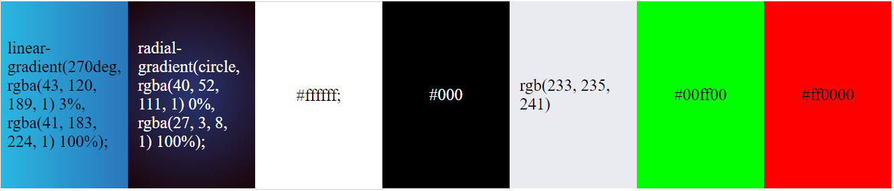
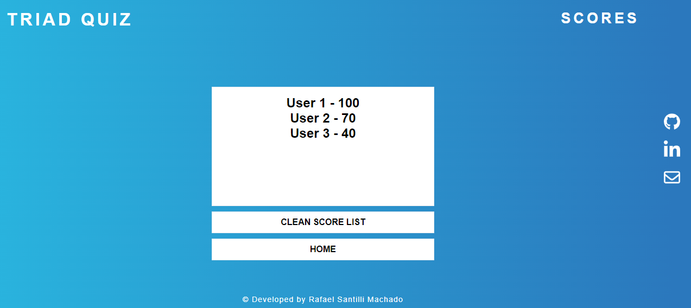

<h1>Triad Quiz - Website</h1>

<h1>Introduction</h1> 

Project milestone 2: HTML/CSS/JavaScript Essentials - Code Institute Full-Stack development program.

Triad Quiz is a quiz game that allows players to test their knowledge in different topics. In Triad Quiz there are 3 different quizzes available and it has 10 questions for each topic. If the user can answer the question correctly they will receive points. It is a good way to have fun and also to learn while playing a game.

<a>[Triad Quiz project page](https://rafaelsanm.github.io/portfolio_project_2/)</a>

<h2>User Experience </h2>

- As a website developer, I'd like to:  
  1- Develop an online quiz  that is visually appealing from the user’s first visit so they are intrigued to explore and play the game.  
  2- Develop an easy to navigate quiz and game for its users to play.  
  3- Develop a quiz that is both attractive and challenging for the user.   
- As a first visitor, I'd like to:   
  1- Be able to understand the main purpose of the game.  
  2- Be able to easily navigate throughout the game and choose a quiz to play.  
  3- Be able to see my results after playing the game.   
- As a returning visitor, I want to:  
  1- Be able to find new quizzes when they are available.  
  2- Be able to check the Scores page.  
  3- Be able to challenge myself and improve on my scores.

<h2>Design</h2>
<h3>Website Structure</h3>
  
The Quiz Land is a seven page website that has been designed to look like an application in small devices.

Pages:

Homepage  
Quiz Sports  
Quiz History  
Quiz Geography  
Game End  
Scores List  
Contact Page  

<h2>Colour Scheme</h2>

The main color scheme I chose for this project is a two-tone blue. The left side of the screen is lighter and the tone changes to a darker blue towards the right side of the screen. I chose a black color for the main container and the same blue as the background color when the user hovers over the quiz links as an interactive color. Green is the color used in the background color when the user gets the answer right and red is the color used in the background color when the user gets the answer wrong.

<h2>Typography</h2>

  - The Inter, sans-serif is used as the main font for the website.
  - Lexend Deca, sans-serif is used in the left-hand container information paragraph on the Homepage.

<h2>Imagery</h2> 

  - 3 Images were used for the aside menu.  
  - 1 image was used for the Favicon.

<h2>Interactive Links</h2>
  At the side menu of the Home page, users can access the social links (Github and Linked-in). Once these icons are clicked they open a new tab. Users can also click on an envelop image link that takes them to the contact page.

<h1>Features</h1>
<h3>Home Page</h3>

  
  - When accessing the website, the user has access to the quizzes to start playing immediately. There is also a button to check the scoring area. In the side menu, the user will find three images that have links, first to Github, second to Linked-in and the third that will take them to the contact page. 

  <a>[Triad Quiz project page](https://rafaelsanm.github.io/portfolio_project_2/)</a>

<h3>Home Page Mobile</h3>

<h3>Quiz Sports</h3>

  - The entire game takes place in this feature. Here users will see the questions and have 4 answer options. The player will choose one and see if the answer given is right or wrong. The thematic questions in Quiz 1 are Sports.

  <a>[Live Feature Here](https://rafaelsanm.github.io/portfolio_project_2/src/html/sports.html)</a>

<h3>Quiz Sports Mobile</h3>

<h3>Quiz Geography</h3>

  - This feature has the same purpose as Quiz 1 and Quiz 2 but here the topic questions are Georaphy.

  <a>[Live Feature Here](https://rafaelsanm.github.io/portfolio_project_2/src/html/geography.html)</a>
  
<h3>Quiz History</h3>

  - This feature has the same purpose as Quiz 1 but here the topic questions are History.

  <a>[Live Feature Here](https://rafaelsanm.github.io/portfolio_project_2/src/html/history.html)</a>

<h3>Scores List</h3>

  - On this page the user can see the score list. There are also 2 buttons on this page, one to reset the list and the other to return to the home page.

  <a>[Live Feature Here](https://rafaelsanm.github.io/portfolio_project_2/src/html/scores.html)</a>

<h3>Game End Page</h3>

  - On this final page of the game, the user will receive a message according to their score. There are also options to try again, save the game, try a different quiz or check the score list.

<h3>Progress Bar Right/Wrong Answers</h3>

  - When starting the quiz, a black bar appears at the top of the page that progressively increases until the user finishes the quiz.
  - When the user gets an answer right, the background color turns green and when he gets it wrong, the background color turns red.

<h2>How To Play</h2>

<h3>How to Start</h3>

  - The player can choose a quiz to play from the menu by pressing one of the quiz buttons on the Homepage.

<h3>The Game</h3>

 - The player has 3 different quizzes in the game. For each quiz the user will see the question on the top center and 4 choices are available. The player then has to choose one of the choices and if the answer is right will win 10 points. While the game is going on, users can see the progress bar updating any time they answer a question.

<h3>Right Answer</h3>

  - When the user answers the question right the background color of their choice answer will turn green.

  - When the user answers the question right the background color of their choice answer will turn red.

<h2>Technologies Used</h2>

<h3>Languages Used</h3>

  - HTML
  - CSS
  - JAVASCRIPT

<h3>Frameworks - Libraries - Programs Used</h3>

  - [Google Fonts:](https://fonts.google.com/)
      Google fonts were used to import the 'Inter' and 'Lexend Deca' font throughout the style.css.
  - [Git:](https://git-scm.com/)
      Git was used for version control by utilizing the Git Bash terminal to commit to Git and Push to GitHub.
  - [GitHub:](https://github.com/)
      GitHub is used to store the project's code after being pushed from Git. 
  - [CSS Gradient:](https://cssgradient.io/)
      CSS Gradient was used get the pages background-color and home page container background-color.
  - [Font Awesome:](https://fontawesome.com/)
      Font Awesome are used as an icons for user UX purposes.
  - [VS Code:](https://code.visualstudio.com/)
      VSCode was used to create and edit the website.

<h2>Testing</h2
             
  The W3C Markup Validator and W3C CSS Validator Services were used to validate every page of the project to ensure there were no syntax errors in the project.

  - https://validator.w3.org/
  - https://jigsaw.w3.org/css-validator/
  - https://jshint.com/

<h3>Jshint</h3>

  All JavaScript files were validated through JSHint, presenting 32 warnings:

  - let' is available in ES6 (use 'esversion: 6') or Mozilla JS extensions (use moz).
  - template literal syntax' is only available in ES6 (use 'esversion: 6')..
  - arrow function syntax (=>)' is only available in ES6 (use 'esversion: 6').

  Google Lighthouse was used to test Performance, Best Practices, Accessibility and SEO on both Desktop and Mobile devices.

  - Desktop results:
  

  - Mobile results:
    

<h2>Functionality</h2>

- All links have been hovered and clicked to ensure accessibility.

- Pages all load correctly on all device screen sizes.

- All social media links work correctly and open on a new tab.

- All the buttons are working correctly and bring the users to the function that they were built for.

<h2>Bugs</h2>  

- No bugs to mention.

<h2>Deployment</h2> 

The website development was created in the "main" branch. This branch was deployed using GitHub Pages.

This site was deployed by completing the following steps:

- Open GitHub.
- Click on the project to be deployed.
- Navigate to the "Settings".
- Navigate down to the "GitHub Pages".
- Select the "main" branch and select "Save".
- The link to the live website was ready on the top.

<h2>Forking This Project</h2>

Fork this project following the steps:

 - Open GitHub.
 - Click on the project to be forked.
 - Find the 'Fork' button to the top right of the page.
 - Once you click the button the fork will be in your repository.

<h2>Content</h2>

  - All the questions provided in the game were taken from Google.

  

